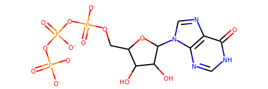

# ITPA_analysis
Analysis of variants of ITPA. No details of pathogenic variants are help here —all data is gnomAD.

## Model

PDB:2J4E is ligand bound (ITP), but has a lower resolution than PDB:2CAR (2.80 Å vs. 1.09 Å).
The two missing loops were added from the latter into the former.
The model was energy minimised in Pyrosetta ([scripts/relax.py](scripts/relax.py)) using 18 FastRelax cycles 
constrained to the electron density of PDB:2J4E.

The ligand was parameterised using [the webapp](https://direvo.mutanalyst.com/params) 
of [rdkit_to_params](https://pypi.org/project/rdkit-to-params/) and the SMILES `C1=NC2=C(C(=O)N1)N=CN2C3C(C(C(O3)COP(=O)([O-])OP(=O)([O-])OP(=O)([O-])[O-])O)O`

## ∆∆G calculations

∆∆G calculations were done by

* mutating the residue
* FastRelax x5 10Å neighbourhood

## Bfactors

Bfactors are conservation scores from [Consurf](https://consurf.tau.ac.il/)

